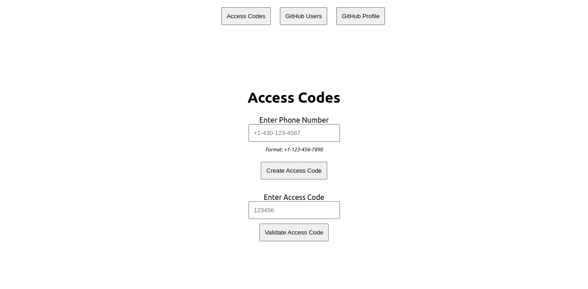
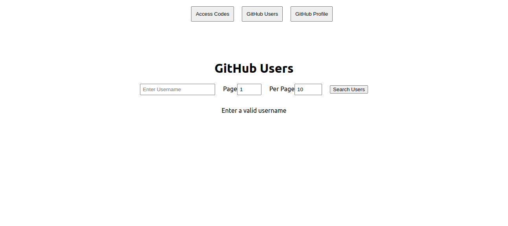
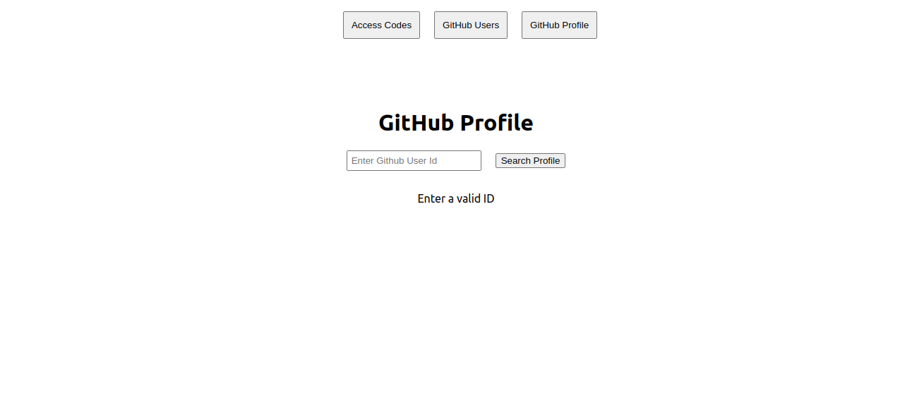

<a name="readme-top"></a>

<div align="center">
 
  <h3><b>Coding Challenge</b></h3>

</div>

<!-- TABLE OF CONTENTS -->

# 📗 Table of Contents

- [📖 About the Project](#about-project)
  - [🛠 Built With](#built-with)
    - [Tech Stack](#tech-stack)
    - [Key Features](#key-features)
    - [Preview](#preview)
- [💻 Getting Started](#getting-started)
  - [Link to Frontend](#link-to-frontend)
  - [Setup](#setup)
  - [Prerequisites](#prerequisites)
  - [Install](#install)
  - [Usage](#usage)
- [👥 Authors](#authors)
- [🤝 Contributing](#contributing)
- [⭐️ Show your support](#support)

<!-- PROJECT DESCRIPTION -->

# 📖 [Coding Challenge] <a name="about-project"></a>

**Coding Challenge** is an application with two parts. The first part involves building an API that allows users to create phone numbers that are saved to the database. An access code is created by the back-end and delivered to the user via SMS. Upon entering the access code, validation is done by the back-end and the user is granted access. The second part involves fetching data from the GitHub API regarding users and displaying it on the front-end. Certain filters are added such as username, page, and displays per page.

## 🛠 Built With <a name="built-with"></a>

### Tech Stack <a name="tech-stack"></a>

<details>
  <summary>Client</summary>
  <ul>
    <li><a href="https://reactjs.org/">React.js</a></li>
  </ul>
</details>

<details>
  <summary>Server</summary>
  <ul>
    <li><a href="https://expressjs.com/">Express</a></li>
  </ul>
</details>

<details>
<summary>Database</summary>
  <ul>
    <li><a href="https://firebase.google.com/">Firebase</a></li>
  </ul>
</details>

<details>
<summary>SMS Service</summary>
  <ul>
    <li><a href="https://www.twilio.com/">Twilio</a></li>
  </ul>
</details>


<!-- Features -->

### Key Features <a name="key-features"></a>

- **[User creates a phone number]**
- **[Access code is generated]**
- **[Phone number is validated using access code]**
- **[A list of GitHub users is access and displayed]**
- **[The list is filtered by name, page, and per_page parameters]**

<!-- Preview -->

### Preview <a name="preview"></a>

<div align="center">
  
   
      

</div>

<p align="right">(<a href="#readme-top">back to top</a>)</p>


<!-- GETTING STARTED -->

## 💻 Getting Started <a name="getting-started"></a>

To get a local copy up and running, follow these steps.

### Prerequisites

In order to run this project you need:

```sh
- git
- node
```

### Link to Frontend

- [Link to Frontend (React)](https://github.com/TracK92/react_front_end.git)

### Setup

Clone this repository to your desired folder:

```bash
$ git clone https://github.com/TracK92/express_back_end.git
```

Clone the frontend repository to your desired folder:

```bash
$ git clone https://github.com/TracK92/react_front_end.git
```


### Install

Install these projects with:

```bash
  cd react_front_end
  npm install
```

```bash
  cd express_back_end
  npm install
```

### Usage

To run the projects in two separate terminals, execute the following command:

```sh
  npm run start
```

N/B: The back-end runs on port 4000 whereas the front-end often runs on port 3000. If you are running both projects on the same machine, you will need to ensure that the front-end project is running on any port but 4000.

#### Access Codes
- Ensure that the back-end is running at all times. This message will appear on the terminal if the back-end is running: `Example app listening at http://localhost:4000`. Note that any errors on the front-end may cause the back-end to stop running. If this happens, you will need to restart the back-end. Use the following commands: ```Ctrl + C``` to stop the back-end and ```npm run start``` to start the back-end again.
- On the front-end, there is a navigation bar (see the preview above) that contains links to the three pages. The Access Codes is the first page. On this page, you will enter a phone number(use +254726993667 as this number is verified by Twilio and, therefore, will not throw any errors. I have console logged the data, which also includes the auto-generated access code). Once you click the "Create Access Code" button, check the console for the pertinent data. Insert the access code in the second input field and click the "Validate Access Code" button. You can test the API by entering different access codes.

#### GitHub Users
- On the front-end, click on the GitHub Users link on the navigation bar. You will see input fields: username, Page, and Per Page. You can filter the list by name, page, and per_page parameters. The default values are: name = "", page = 1, and per_page = 10. You can change these values and click the "Search" button to see the results. 
N/B: Ensure that the back-end is still running, particularly if you run into any errors.

#### GitHub Profiles
- On the front-end, click on the GitHub Profile link on the navigation bar. You will see an input field for id numbers. Enter any number and click on the search profile icon to see which user owns that particular GitHub profile. The results appear in a table below the input section.

<p align="right">(<a href="#readme-top">back to top</a>)</p>

<!-- AUTHORS -->

## Authors

👤 **Tracey Kadenyi**

- GitHub: [@TracK92](https://github.com/TracK92)
- LinkedIn: [@Tracey Kadenyi](https://www.linkedin.com/in/Tracey-Kadenyi/)
- Twitter: [@traci_K7](https://twitter.com/traci_k7)

<!-- CONTRIBUTING -->

## 🤝 Contributing <a name="contributing"></a>

Contributions, issues, and feature requests are welcome!

Feel free to check the [issues page](../../issues/).

<p align="right">(<a href="#readme-top">back to top</a>)</p>

<!-- SUPPORT -->

## ⭐️ Show your support <a name="support"></a>

Give a ⭐️ if you like this project!

<p align="right">(<a href="#readme-top">back to top</a>)</p>
